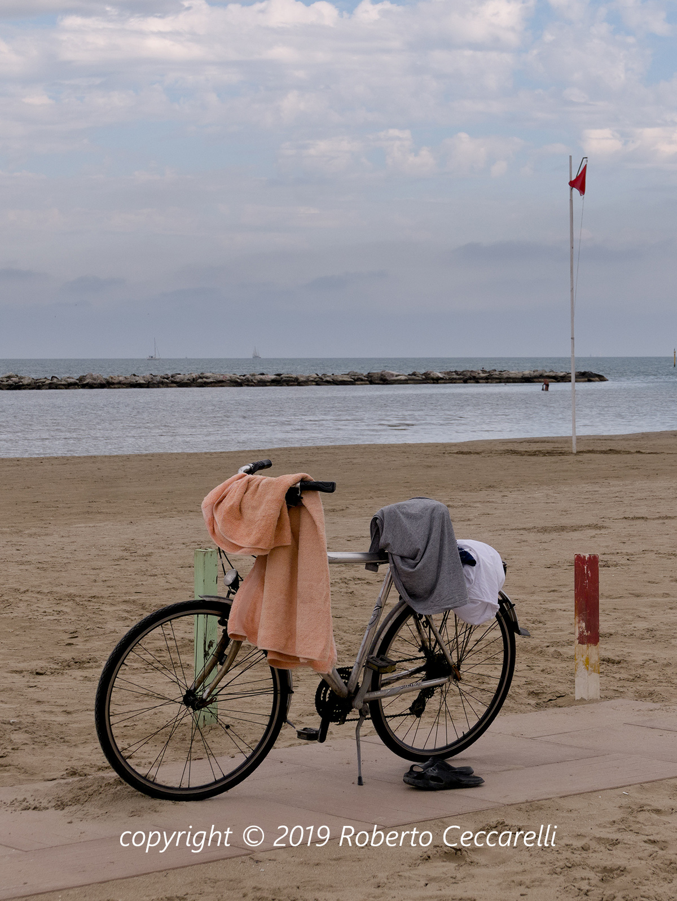

### Casasoft Contemporary Carte de Visite Tools

# Sample scripts and images

## Scripts

- **AddLabel.cs**  
Resizes the loaded image, puts it on a full-size canvas aligned to top
and adds the name of the image at the bottom side
- **AddLabel.cmd**  
MontaggioFoto launcher to try the above script

## Images

Horizontal CDV front

Vertical CDV front

Horizontal CDV back

Vertical CDV back
